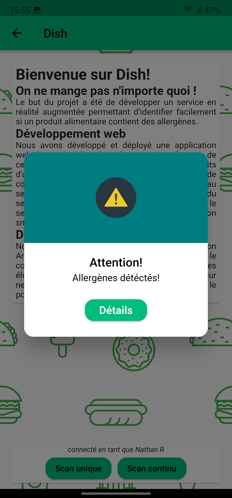

# Dish

Application Android du service Dish sur la plateforme Flutter en Dart.

La version la plus récente est disponible dans ce même repo sur `web-projetISEN/dish.apk`.

## Captures d'écran

Page de connexion:

Pop-up de confirmation de réinitialisation de mot de passe:

Page d'accueil:

Pop-up de produit sans allergènes:

Pop-up d'allergènes détéctés:

Page de détails sur les allergènes:

## Crédits

Nathan RANAIVO RAVOAJA: nathan.ranaivo-ravoaja@isen-ouest.yncrea.fr
