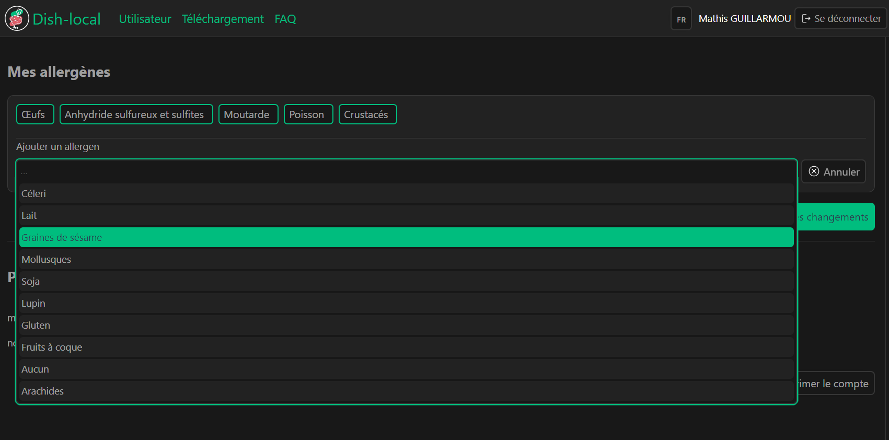
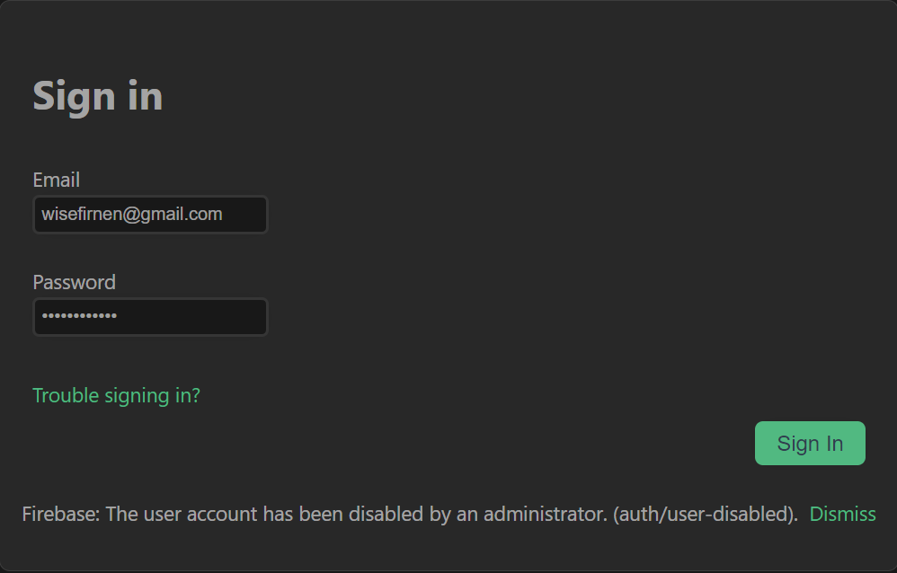

# QnA

On this page you will find helpful information about the use and functioning of Dish, the allergen detection application.

If you cannot find the answer to one of your question, feel free to [contact us](/contact).

---
## How do I fill in my allergens?
To fill in your allergens, visit the [User page](/user).
Here you can add and view the allergens you have already filled in.
By clicking on the [+] button, you can choose an allergen from the displayed list.

Remember to save the changes made by clicking on the _Save Changes_ button.

## My account seems deactivated. What should I do ?
If you encounter the following error while trying to log in, it is that your account has been deactivated by an administrator:

You can [contact us](/contact) to solve this problem, or create a new account with a different email address from the blocked account.

## How to download the mobile app ?
The mobile app can be downloaded from the [download page](/download).
An APK file will then be downloaded to your computer.
This one corresponds to a mobile application that you can install on your smartphone.
Make sure your smartphone allows application installation from this type of file.

## What do I do if I forgot my password?
If you forget your password, you can request a new one.
To do this, go to [the login page](/signin).
After filling in your login email address, click _Troubles signin in? _ .

You will then receive an email to the email address you entered, which will allow you to enter a new password.

## How do I fill in an allergen that is not on the list?
If an allergen is not available in the list of allergens, please [contact our team](/contact).

