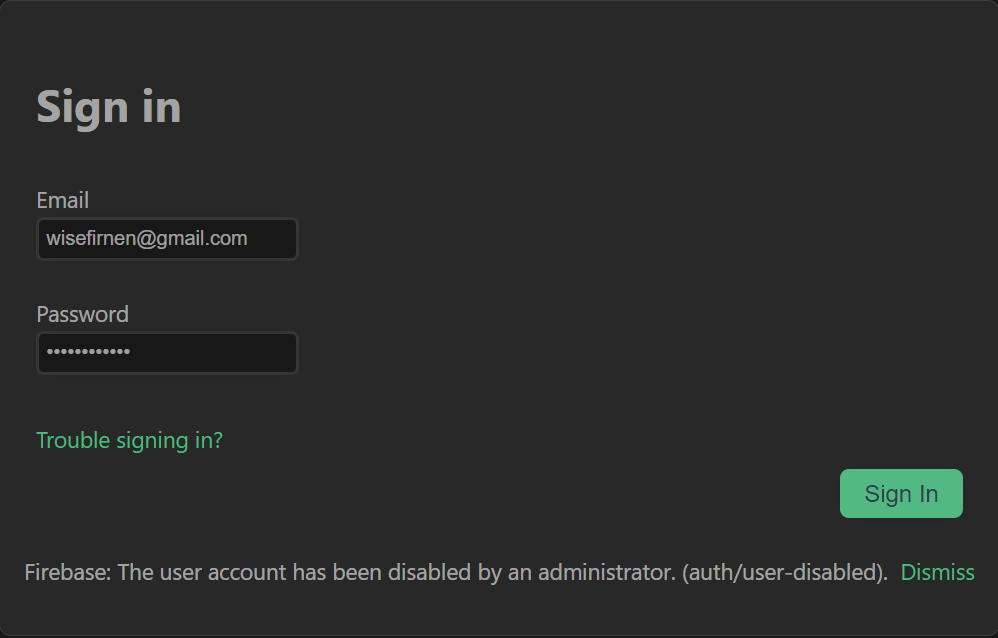

# FAQ

Vous trouverez sur cette page des informations utiles sur l'utilisation et le fonctionnement de Dish, l'application de détection d'allergènes.

Si vous ne trouvez pas de réponse à votre question, n'hésitez pas [nous contacter](/contact).

---

## Comment renseigner mes allergènes ?
Pour renseigner vos allergènes, rendez-vous sur la page [Utilisateur](/user).
Ici, vous pouvez ajouter et visualiser les allergènes que vous avez déjà renseignés.
En cliquant sur le bouton [+], vous avez la possibilité de choisir un allergène parmi la liste affichée.

N'oubliez pas de sauvegarder les modifications effectuées en cliquant sur le bouton _Sauvegarder les changements_.

## Mon compte est marqué comme étant désactivé. Que dois-je faire ?
Si en essayant de vous connecter vous rencontrer l'erreur suivante, c'est que votre compte a été désactivé par un administrateur :

Vous pouvez [nous contacter](/contact) afin de résoudre ce problème, ou créer un nouveau compte avec une adresse mail différente du compte bloqué.

## Comment télécharger l'application mobile ?
L'application mobile peut être téléchargée sur [la page de téléchargement](/download).
Un fichier sous format APK sera alors téléchargé sur votre ordinateur.
Celui-ci correspondant à une application mobile que vous pouvez installer sur votre smartphone.
Assurez-vous que votre smartphone permette l'installation d'application à partir de ce type de fichier.

## Que faire en cas d'oubli de mot de passe ?
En cas d'oubli de mot de passe, vous pouvez en demandez un nouveau.
Pour cela, rendez-vous sur [la page de connexion](/signin).
Après avoir renseigné votre adresse mail de connexion, cliquez sur _Troubles signin in?_ .

Vous recevrez alors un mail à l'adresse mail renseignée qui vous permettra de renseigner un nouveau mot de passe.

## Comment renseigner un allergène qui n'est pas présent dans la liste ?
Si un allergène n'est pas disponible dans la liste des allergènes, veuillez [prendre contact avec notre équipe](/contact).

